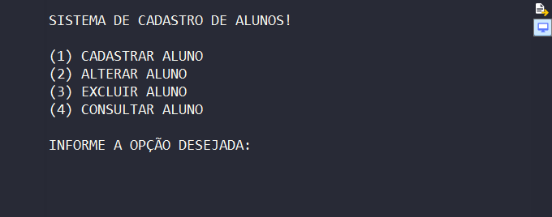
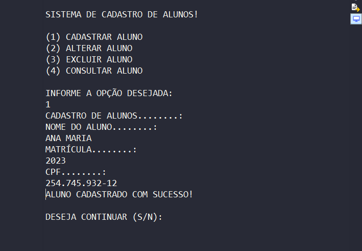
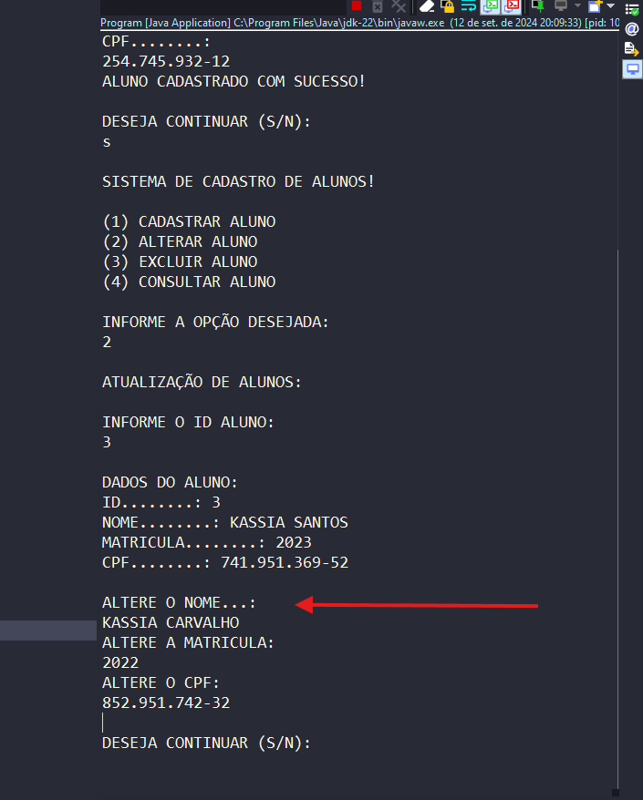
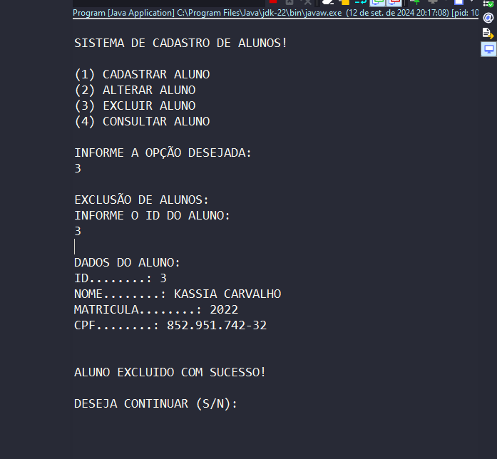
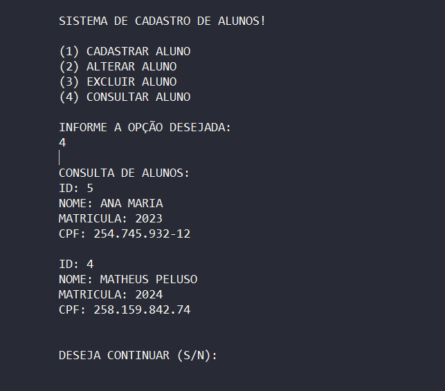
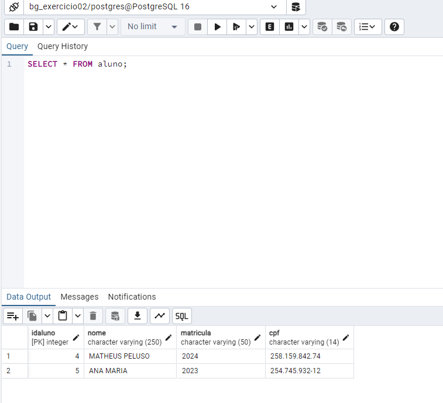

## 📚Sobre

**javaExercicio02** - Segundo exercicio do curso Java fullstack develloper da coti informatica.
O exercicio trata-se de um CRUD de alunos, onde foi criado funcionalidades para Cadastro , Atualização, Exclução e Consulta de alunos, 
e persistir todas as mudanças em um banco de dados *PostgreSQL*

Aluno: Matheus Peluso
Professor: Sergio Mendes 

## 🏜️ Fotos do projeto
<div align="center">
    
    
    
    
    
    
</div>


## Como clonar o projeto
```bash
    # clone o projeto
    git clone https://github.com/matheuspeluso/javaExercicio02.git
    
```

## ferramentas utilizadas no projeto
    - Jdk 22.0.1
    - Eclipse IDE
    - pgAdmin 4